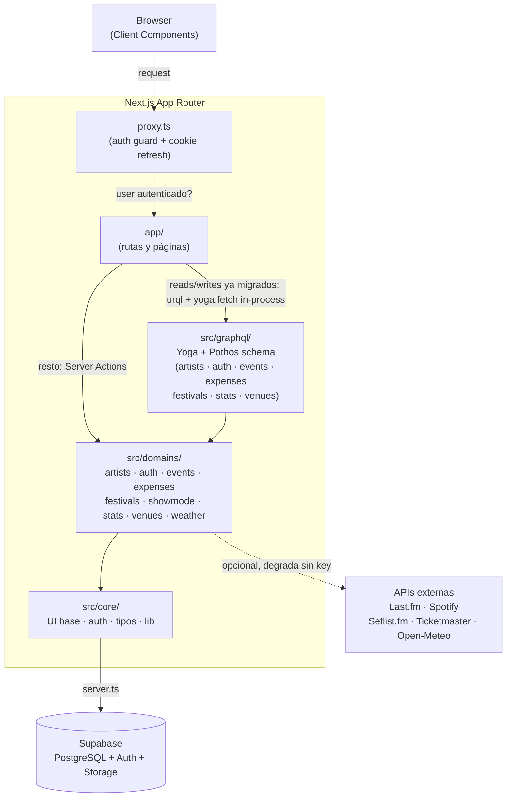

# 🕯️ RITUAL


**Plataforma de gestión de itinerarios, giras y memoria para recitales. Open Source.**

> *"La procesión va por dentro... y en la app."*

Ritual es un proyecto de código abierto nacido para centralizar la experiencia de la música en vivo. No es solo una agenda, es la bitácora colectiva de nuestra vida musical.

**¿Por qué Open Source?**
Porque la música es cultura compartida. Queremos que RITUAL sea construido por la comunidad que lo usa: manijas, archivistas, desarrolladores y diseñadores que aman los recitales.

## ✨ Características (Features)

### 🗺️ La Procesión (Itinerario)
- **Buscador de Eventos**: Base de datos de recitales y festivales.
- **Agenda Personal**: Marcá los shows a los que vas a ir ("Voy").
- **Wishlist**: Seguí a tus artistas favoritos.

### 💰 La Ofrenda (Gastos)
- **Gestión de Gastos**: Registrá entradas, transporte y consumiciones.
- **División de Gastos**: (Próximamente) Repartí costos con amigos.

### 🏛️ El Santuario (Memoria)
- **Historial de Shows**: Registro automático de eventos pasados.
- **Portales**: Páginas ricas de Artistas, Festivales y Venues.

## 🤝 Cómo Contribuir

¡Toda ayuda es bienvenida! Ya sea reportando bugs, proponiendo ideas o tirando código.

1.  Revisá los [Issues abiertos](https://github.com/Lantieridev/Ritual/issues) para ver qué falta hacer. Los marcados como "good first issue" o "help wanted" son ideales para empezar.
2.  Leé nuestra [Guía de Contribución](./CONTRIBUTING.md) para conocer los estándares de código.
3.  Hacé un Fork y mandá tu Pull Request.

## 🛠 Stack Tecnológico

- **Frontend**: [Next.js 16](https://nextjs.org/) (App Router) + TypeScript.
- **Estilos**: [Tailwind CSS 4](https://tailwindcss.com/) + CSS Variables.
- **Backend**: [Supabase](https://supabase.com/) (PostgreSQL, Auth, Storage).
- **API**: GraphQL ([GraphQL Yoga](https://the-guild.dev/graphql/yoga-server) + [Pothos](https://pothos-graphql.dev/), code-first) consumido con [urql](https://commerce.nearform.com/open-source/urql/) — reemplazando Server Actions dominio por dominio (migración en curso, ver [issue #23](https://github.com/Lantieridev/Ritual/issues/23) y [ADR 0004](./docs/adr/0004-graphql-migration-strangler-fig.md)).
- **APIs Externas**: Last.fm, Spotify, Setlist.fm, Ticketmaster, Open-Meteo.

## 🚀 Instalación Local

Queremos que sea fácil levantar el proyecto.

1.  **Clonar el repositorio:**
    ```bash
    git clone https://github.com/Lantieridev/ritual.git
    cd ritual
    ```

2.  **Instalar dependencias:**
    ```bash
    npm install
    # o
    bun install
    ```

3.  **Configurar variables de entorno:**
    Creá un `.env.local` en la raíz con estas variables (pedilas en Discord o usá tu propio proyecto Supabase gratuito):
    ```bash
    NEXT_PUBLIC_SUPABASE_URL=
    NEXT_PUBLIC_SUPABASE_ANON_KEY=
    NEXT_PUBLIC_SITE_URL=http://localhost:3000

    # Opcionales — las features que los usan degradan sin romperse si falta la key
    LASTFM_API_KEY=
    SETLISTFM_API_KEY=
    SPOTIFY_CLIENT_ID=
    SPOTIFY_CLIENT_SECRET=
    TICKETMASTER_API_KEY=
    ```

4.  **Correr el entorno de desarrollo:**
    ```bash
    npm run dev
    ```
    Abrir [http://localhost:3000](http://localhost:3000).

## 🧭 Arquitectura



Cuatro de seis dominios con escritura (`artists`, `expenses`, `festivals`, `venues`) ya migraron por completo a GraphQL. `events` y `auth` son híbridos: alta/edición/borrado de eventos y edición de perfil pasan por GraphQL, pero asistencia, fotos, avatar, login/signup/signout y reset de contraseña siguen siendo Server Actions. `showmode` (modo recital activo) es 100% Server Actions por ahora — no migró en esta tanda.

Decisiones de arquitectura documentadas en [`docs/adr/`](./docs/adr/README.md) — por qué `core/` vs `domains/`, por qué el cliente de Supabase está partido por contexto de ejecución, por qué las API keys externas son opcionales, y por qué el backend está migrando de Server Actions a GraphQL.

## 📂 Estructura del Proyecto

- `app/`: Rutas y páginas (Next.js App Router), incluye `app/api/graphql/` (endpoint único de GraphQL).
- `src/core/`: Componentes base (UI), librerías (Supabase, API clients) y tipos globales.
- `src/domains/`: Lógica de negocio dividida por dominio (Artists, Auth, Events, Expenses, Festivals, Show Mode, Stats, Venues, Weather).
- `src/graphql/`: Schema GraphQL (Pothos) y servidor (Yoga) — un archivo por dominio migrado, ver [`docs/estructura-del-proyecto.md`](./docs/estructura-del-proyecto.md).
- `supabase/`: Migraciones y configuración de base de datos.
- `docs/`: Documentación del proyecto (incluye [`adr/`](./docs/adr/README.md), decisiones de arquitectura).

## 📜 Licencia

Distribuido bajo la licencia MIT. Ver `LICENSE` para más información.

---
*Construido con ❤️ por [Lantieridev](https://github.com/Lantieridev) y la comunidad.*